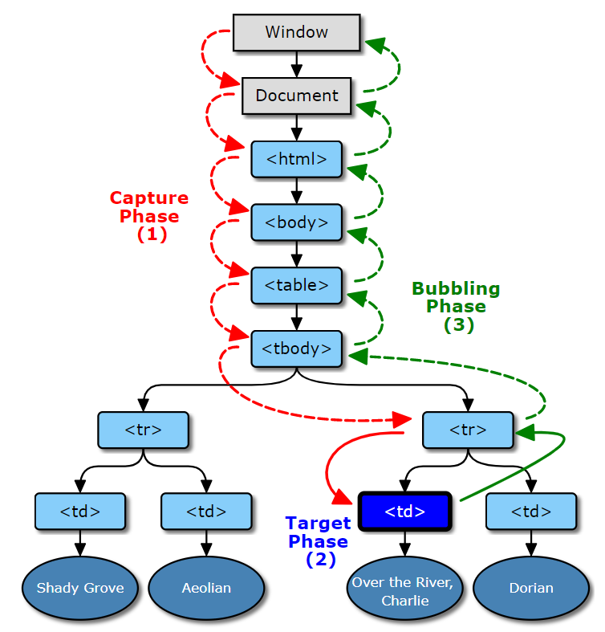

# 事件

## 1 事件概览

- 事件是可以被 JavaScript 侦测到的行为。
1. 鼠标事件
onclick	当用户点击某个对象时调用的事件句柄。	2
oncontextmenu	在用户点击鼠标右键打开上下文菜单时触发
ondblclick	当用户双击某个对象时调用的事件句柄。	2
onmousedown	鼠标按钮被按下。	2
onmouseenter	当鼠标指针移动到元 素上时触发。	2
onmouseleave	当鼠标指针移出元素时触发	2
onmousemove	鼠标被移动。	2
onmouseover	鼠标移到某元素之上。	2
onmouseout	鼠标从某元素移开。	2
onmouseup	鼠标按键被松开。  2
     
2. 键盘事件
 
onkeydown	某个键盘按键被按下。	2   
onkeypress	某个键盘按键被按下并松开。	2   
onkeyup	某个键盘按键被松开。   2  
 
3. 框架/对象（Frame/Object）事件
 
onabort	图像的加载被中断。 ( <object>)	2
onerror	在加载文档或图像时发生错误。 ( <object>, <body>和 <frameset>)	   
onload	一张页面或一幅图像完成加载。	2
onresize	窗口或框架被重新调整大小。	2
onscroll	当文档被滚动时发生的事件。	2
onunload	用户退出页面。 ( <body> 和 <frameset>)	2     

4. 表单事件
onblur	元素失去焦点时触发	2  
onchange	该事件在表单元素的内容改变时触发( <input>, <keygen>, <select>, 和 <textarea>)	2   
onfocus	元素获取焦点时触发	2  
onfocusin	元素即将获取焦点时触发	2  
onfocusout	元素即将失去焦点时触发	2  
oninput	元素获取用户输入时触发	3   
onreset	表单重置时触发	2   
onsearch	用户向搜索域输入文本时触发 ( <input="search">)	   
onselect	用户选取文本时触发 ( <input> 和 <textarea>)	2  
onsubmit	表单提交时触发	2  

## 2 DOM事件流
- DOM2 级事件规定的事件流包含3个阶段：事件捕获阶段/处于目标阶段和事件冒泡阶段。
首先是事件捕获（Netscape 事件流），然后是目标接收到事件，最后是冒泡阶段（IE浏览器事件流）。
- DOM0级事件，触发的事件均在冒泡阶段执行
- **实际浏览器实现过程中在捕获和冒泡阶段皆触发目标上的事件（DOM2级绑定）**。        


示例：事件流1.html

0. HTML事件处理程序
HTML事件处理程序即在标签内写事件，如：
<input type='button' value='Click Me' onclick = 'alert(111)'>


1. DOM 0级事件处理程序

- 为同一个元素/标签绑定多个同类型事件的时候（如给上面的这个btn元素绑定3个点击事件），是不被允许的，后面绑定的处理函数会覆盖前面绑定的；  
- DOM0事件绑定，给元素的事件行为绑定方法，这些方法都是在当前元素事件行为的**冒泡阶段**(或者目标阶段)执行的。

```
 
//在JS写onclick=function(){}函数

<input id="myButton" type="button" value="Press Me" onclick="alert('thanks');" >
document.getElementById("myButton").onclick = function () {
    alert('thanks');
}
```

2. 没有DOM 1级事件处理程序
DOM级别1于1998年10月1日成为W3C推荐标准。1级DOM标准中并没有定义事件相关的内容，所以没有所谓的1级DOM事件模型。

3. DOM 2级事件处理程序
- addEventListener / removeEventListener 
- 它们都有三个参数：
   > 第一个参数是事件名（如click）；
   > 第二个参数是事件处理程序函数；
   > 第三个参数如果是true则表示在捕获阶段调用，为false表示在冒泡阶段调用。
- addEventListener():可以为元素添加 __多个__ 事件处理程序，触发时会按照添加顺序依次调用。
- removeEventListener():不能移除匿名添加的函数。
- 只能给某个事件绑定多个 “不同”的方法 ； 如：       
  ele.addEventListener("click",fn1,false);ele.addEventListener("click",fn1,false) ;只执行一次fn1
- dom 0级 事件是元素的私有属性，如onclick， 而addEventListener 是位于 EventTarget上   

4. DOM 3级事件
在DOM 2级事件的基础上添加了更多的事件类型。

- UI事件，当用户与页面上的元素交互时触发，如：load、scroll   
- 焦点事件，当元素获得或失去焦点时触发，如：blur、focus              
- 鼠标事件，当用户通过鼠标在页面执行操作时触发如：dblclick、mouseup                
- 滚轮事件，当使用鼠标滚轮或类似设备时触发，如：mousewheel             
- 文本事件，当在文档中输入文本时触发，如：textInput                
- 键盘事件，当用户通过键盘在页面上执行操作时触发，如：keydown、keypress           
- 合成事件，当为IME（输入法编辑器）输入字符时触发，如：compositionstart                   
- 变动事件，当底层DOM结构发生变化时触发，如：DOMsubtreeModified                 
- 同时DOM3级事件也允许使用者自定义一些事件。               
 


5. IE 事件处理程序
- attachEvent/ detachEvent
- 接受2个参数，事件名称和事件处理回调函数；只支持冒泡
IE6~8 问题：
> 绑定的多个事件处理函数，顺序执行并不是按照绑定的顺序执行
> 绑定多个相同的事件处理函数，可以多次执行，标准浏览器则不会重复执行
> 事件中的this 是window ，不是绑定的事件的元素
 


```
   var EventUtil = {
       addHandler:function (ele,type,handler) {
           if(ele.addEventListener){
               ele.addEventListener("type",handler,false);
           }else if(ele.attachEvent){
               ele.attachEvent("on"+type,handler);
           }else{
               ele["on"+type] = handler;
           }
       },
       removeHandler:function (ele,type,handler) {
           if(ele.removeEventListener){
               ele.removeEventListener("type",handler,false);
           }else if(ele.detachEvent){
               ele.detachEvent("on"+type,handler);
           }else{
               ele["on"+type] = null;
           }
       }
   }
```

## 3 鼠标事件对象
- 鼠标事件触发时，浏览器默认给方法传递一个参数 MouseEvent
- MouseEvent ---> UIEvent ---> Event ---> Object 
- MouseEvent 记录的是页面唯一一个鼠标触发时的相关信息，和在哪个元素上触发没有关系   
- 事件对象兼容性： ie6~8 ,浏览器不给事件绑定的回调函数传递参数，需要从Window.event获取

### 3.1 事件对象属性/方法
- type：事件的类型，如onlick中的click；
- cancelBubble：一个布尔属性，把它设置为true的时候，将停止事件进一步冒泡到包容层次的元素（一个阻止冒泡的历史别名）；(e.cancelBubble = true; 相当于 e.stopPropagation();)
- preventDefault()/ returnValue：函数 / 一个布尔属性，设置为false的时候可以组织浏览器执行默认的事件动作；(e.returnValue = false; 相当于 e.preventDefault();)
- screenX、screenY：鼠标指针相对于显示器左上角的位置，如果
- bubbles: 布尔值，表明事件是否冒泡
- currentTarget: 元素，为事件处理程序当前正在处理事件的那个元素   
- target/srcElement(ie)：事件源，就是发生事件的元素（事件的真正目标）；
- eventPhase:  整数，事件处理程序的阶段
- stopPropagation(): 停止事件冒泡 
- stopImmediatePropagation：既能阻止事件向父元素冒泡，也能阻止元素同事件类型的其它监听器被触发。而 stopPropagation 只能实现前者的效果。


- clientX/clientY：事件发生的时候，鼠标相对于浏览器窗口可视文档区域的左上角的位置；(在DOM标准中，这两个属性值都不考虑文档的滚动情况，
也就是说，无论文档滚动到哪里，只要事件发生在窗口左上角，clientX和clientY都是 0，所以在IE中，要想得到事件发生的坐标相对于文档开头的位置，要加上
document.body.scrollLeft和 document.body.scrollTop)
- offsetX,offsetY/layerX,layerY：事件发生的时候，鼠标相对于源元素左上角的位置；
-  pageX,pageY：检索相对于父要素鼠标水平坐标的整数；
   e.pageX = e.pageX || (e.clientX +(document.documentElement.scrollLeft || document.body.scrollLeft))

- altKey,ctrlKey,shiftKey等：返回一个布尔值；
- keyCode：返回keydown何keyup事件发生的时候按键的代码，以及keypress 事件的Unicode字符；(firefox2不支持 event.keycode，可以用 event.which替代 )

```
// stopImmediatePropagation 示例
const btn = document.querySelector('#btn');
btn.addEventListener('click', event => {
  console.log('btn click 1');

  event.stopImmediatePropagation();
});
btn.addEventListener('click', event => {
  console.log('btn click 2');  // 不执行
});
document.body.addEventListener('click', () => {
  console.log('body click');
});
// btn click 1
 

```


```
<body style="margin: 1000px">
<form action="post">
    <input  type="text" name="username" value=""><br>
    <input id="myButton" type="button" value="Press Me"  >
</form>
<script type="text/javascript">
    var button = document.getElementById("myButton");
    var EventUtil = {
        addHandler:function (ele,type,handler) {
            if(ele.addEventListener){
                ele.addEventListener(type,handler,false);
            }else if(ele.attachEvent){
                ele.attachEvent("on"+type,handler);
            }else{
                ele["on"+type] = handler;
            }
        },
        removeHandler:function (ele,type,handler) {
            if(ele.removeEventListener){
                ele.removeEventListener(type,handler,false);
            }else if(ele.detachEvent){
                ele.detachEvent("on"+type,handler);
            }else{
                ele["on"+type] = null;
            }
        },
        getEvent:function (e) {
            return e? e : window.event;
        },
        getTarget:function (e) {
            return event.target  || event.srcElement;
        },
        preventDefault:function (e) {
            if(e.preventDefault){
                e.preventDefault();
            }else{
                e.returnValue = false;
            }
        },
        stopPropagation: function (e) {
            if(e.stopPropagation){
                e.stopPropagation(); //可以取消捕获和冒泡
            }else{
                e.cancelBubbble = true;  //ie中使用，只能取消冒泡
            }
        },
        getPageX:function (e) {
            return e.pageX? e.pageX:  (e.clientX +(document.documentElement.scrollLeft || document.body.scrollLeft));
        }
    }

    button.onclick = function (e) {
        // 注意：先获取e对象
        e = EventUtil.getEvent();
        console.log(EventUtil.getPageX(e)); //1036
    }
    EventUtil.addHandler(button,"click",function (e) {
        e = EventUtil.getEvent();
        console.log(EventUtil.getPageX(e)); //1036
    });
</script>
```


## 4 UI 事件
- load ：加载后触发，用于window、img、object等上
- unload：完全卸载后触发
- abort：停止下载时触发
- error：
- select：选择input 或 textarea 中的一个或多个字符时触发
- resize
- scroll

## 4.1 load 事件

0. window、body上都可绑定load事件 
1. img 上绑定load事件，应该在指定src属性之前先指定事件，然后给img的src赋值。
2. script和link 动态插入时，绑定事件和指定元素的地址（script为src/link为href）的顺序不重要，   
因为只有在指定了src/href后，将其添加到dom中后才开始下载脚本或样式文件。

## 4.2 焦点 事件
- blur：失去焦点触发，不冒泡
- focus：获得焦点触发，不冒泡
- focusin：获得焦点触发，与focus区别为其冒泡
- focusout：获得焦点触发，与blur区别为其冒泡

## 4.3 滚轮 事件


## 事件委托/事件代理
- 利用事件的冒泡传播机制（触发当前元素的某个行为，它父级所有元素的相关行为都会被触发），如果一个容器中有很多元素都要绑定点击事件，没有必要每个都绑定，只需要给最外层的容器绑定点击事件即可   
在这个方法执行时，通过事件源的区分来进行不同的操作   
  


