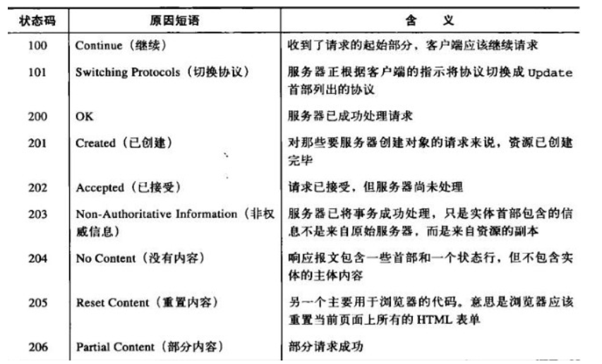
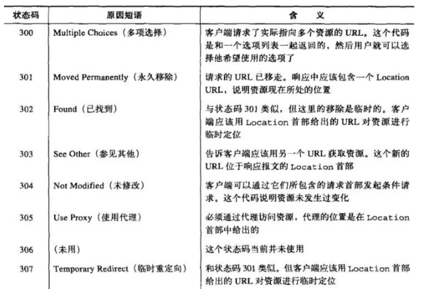
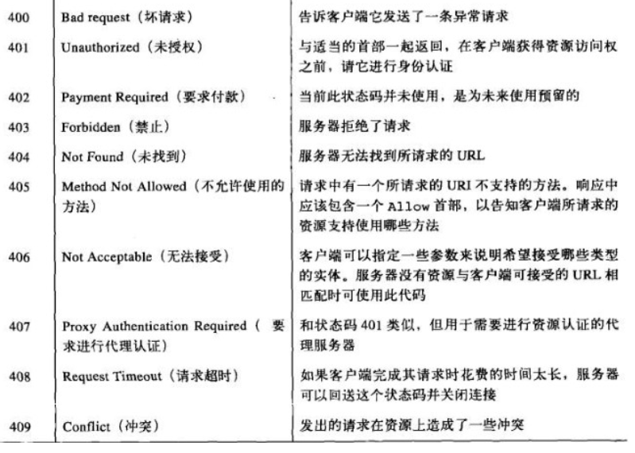
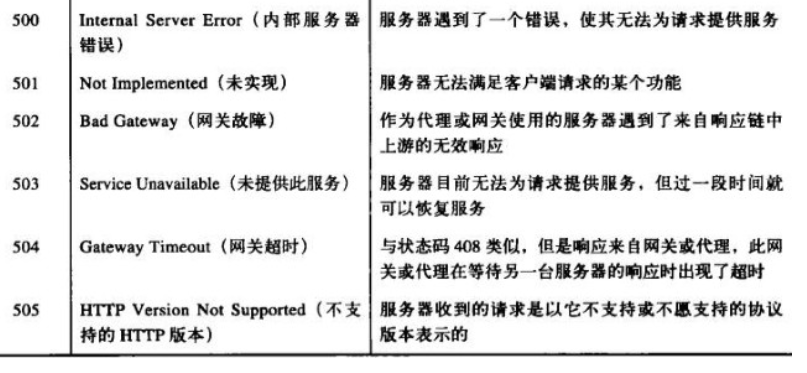

# AJAX

## JSON
JSON: Javascript Object Notation ，Javascript 对象表示法

JSON是一种用于数据交换的文本格式，目的是取代繁琐笨重的 XML 格式。 

JSON 对值的类型和格式有严格的规定。

  1. 复合类型的值只能是数组或对象，不能是**函数、正则表达式对象、日期**对象。

  2. 原始类型的值只有四种：字符串、数值（必须以十进制表示）、布尔值和null（不能使用NaN, Infinity, -Infinity和undefined）。

  3. 字符串必须使用**双引号**表示，不能使用单引号。

  4. 对象的键名必须放在双引号里面。

  5. 数组或对象最后一个成员的后面，不能加逗号。


```
//非法的JSON
{ "name": "张三", "age": undefined } // 不能使用 undefined

{ "name": "张三",
  "birthday": new Date('Fri, 26 Aug 2011 07:13:10 GMT'),
  "getName": function () {
      return this.name;
  }
} // 属性值不能使用函数和日期对象
```


### 1 JSON 对象
JSON对象是 JavaScript 的原生对象，用来处理 JSON 格式数据。它有两个静态方法：JSON.stringify()和JSON.parse()。

#### 1.1 JSON.stringify()

JSON.stringify方法用于将一个值转为 JSON 字符串。

- 第一个参数：要stringify的内容      
- 第二参数：如果为数组，可指定需要转成字符串的属性；如果是一个函数，用来更改JSON.stringify的返回值，函数的两个参数，分别是被转换的对象的键名和键值        
- 第三个参数：用于增加返回的 JSON 字符串的可读性。如果是数字，表示每个属性前面添加的空格（最多不超过10个）；如果是字符串（不超过10个字符），则该字符串会添加在每行前面。           


```
JSON.stringify('abc') // ""abc""  ,注意这里的双引号
JSON.stringify(1) // "1"
JSON.stringify(false) // "false"
 
JSON.stringify([1, "false", false])
// '[1,"false",false]'

JSON.stringify({ name: "张三" })
// '{"name":"张三"}'

```

- 如果对象的属性是undefined、函数或 XML 对象，该属性会被JSON.stringify过滤**。
- 如果数组的成员是undefined、函数或 XML 对象，则这些值被转成null。
- JSON.stringify方法会忽略对象的不可遍历的属性。
- 正则对象会被转成空对象。

```
// 属性是undefined、函数或 XML 对象，该属性会被JSON.stringify过滤
var obj = {
  a: undefined,
  b: function () {}
};

JSON.stringify(obj) // "{}"


// 数组的成员是undefined、函数或 XML 对象，则这些值被转成null 
var arr = [undefined, function () {}];
JSON.stringify(arr) // "[null,null]"

// 正则对象会被转成空对象
JSON.stringify(/foo/) // "{}"

//JSON.stringify方法会忽略对象的不可遍历的属性 
var obj = {};
Object.defineProperties(obj, {
  'foo': {
    value: 1,
    enumerable: true
  },
  'bar': {
    value: 2,
    enumerable: false
  }
});

JSON.stringify(obj); // "{"foo":1}"
```


#### 1.2 参数对象的 toJSON 方法
如果参数对象有自定义的toJSON方法，那么JSON.stringify会使用这个方法的返回值作为参数，而**忽略原对象的其他**属性。

```
var user = {
  firstName: '三',
  lastName: '张',

  get fullName(){
    return this.lastName + this.firstName;
  },

  toJSON: function () {
    return {
      name: this.lastName + this.firstName
    };
  }
};

JSON.stringify(user)
// "{"name":"张三"}"
```

#### 1.3 JSON.parse()
JSON.parse方法用于将 JSON 字符串转换成对应的值。
- JSON.parse方法可以接受一个处理函数，作为第二个参数，用法与JSON.stringify方法类似

```
JSON.parse('{}') // {}
JSON.parse('true') // true
JSON.parse('"foo"') // "foo"
JSON.parse('[1, 5, "false"]') // [1, 5, "false"]
JSON.parse('null') // null

var o = JSON.parse('{"name": "张三"}');
o.name // 张三

```
 

## 1 环境搭建

### 1.1 使用WAMP一站式环境
1. 下载对应版本的WAMP（32位/64位），双击安装包安装，安装过程很简单。
2. 配置。
   配置Apache。C:\wamp\bin\apache\Apache2.2.17\conf\httpd.conf
   **配置默认的根目录**：
   在httpd.conf中找到  DocumentRoot "c:/wamp/www/", <Directory "c:/wamp/www/"> 修改根文件目录即可。
   **修改外部访问**：
   在httpd.conf中找到 <Directory "c:/wamp/www/"> 下的        
   
   ```
	# onlineoffline tag - don't remove
    Order Deny,Allow
    Allow from all  
    Allow from 127.0.0.1
   ```   
   
   ```
      <Directory "cgi-bin">
          AllowOverride None
          Options None
          Order allow,deny
          Allow from all
      </Directory>
   ```

将 Deny from all  改为 Allow from all，则其他机器可以访问本服务器。 
此时，可通过局域网内另外一台机器进行测试：先ipconfig 获取本机的ip，**关闭本机防火墙**，在另外的一台机器访问即可

**配置虚拟主机**：   

1.在httpd.conf中找到：
# Virtual hosts
# Include conf/extra/httpd-vhosts.conf
去掉 # Include conf... 前面的#。注意：**此时访问localhost/index.php等 会存在问题，提示404.**

2.打开 C:\wamp\bin\apache\Apache2.2.17\conf\extra\httpd-vhosts.conf，添加：

```
<VirtualHost *:80>
    DocumentRoot "c:/wamp/www/example"
    ServerName www.example.com
</VirtualHost>

```

3.打开 C:\Windows\System32\drivers\etc\hosts,添加：

```
127.0.0.1       www.example.com
```


## 2 准备知识
	
### 2.1 URL、URI、URN

URI：统一资源标识符，URI就像英特网上的邮政地址一样，在世界范围内唯一标识并定位信息资源；
     URI 有两种形式，分别为URL 和 URN

URL：统一资源定位符是资源标识符的最常见形式， URL描述了一台特定服务器上某资源的特定位置。
URN：URI 的第二种形式为统一资源名，URN 是作为特定内容的唯一名称使用的，与目前的资源所在地无关。
     比如，不论英特网标准文档RFC 2141 位于何处，都可以用下列URN命名它：
     urn:ietf:rfc:2141

示例：http://v.qq.com:80/index.html?name=zhangsan&age=22#bbs
http: 传输协议 
     （http:默认端口80；https：默认端口443； FTP文件传输协议：默认21端口）
v.qq.com ：域名
80 端口
index.html ： 请求资源文件名
?name=zhangsan&age=22 URL传参
#bbs ：URL的hash （锚点定位）

###  2.2 php
使用php编写服务端。


###  2.3 node.js
使用node.js编写服务端。

 
### 2.4 HTTP
详细可见 HTTP相关知识，此处仅简要介绍必备知识。

nslookup baidu.com  查询dns
curl -s -v -H "dell:xxx" -- "https://www.baidu.com"

curl -X POST -s -v -H "dell:xxx" -- "https://www.baidu.com

curl -X POST -d "123456" -s -v -H "dell:xxx" -- "https://www.baidu.com"


-s :--silent
-v :--verbose
-H :--header
-X : --request
-d :--data 
-L：--location 参数会让 HTTP 请求跟随服务器的重定向

查询命令网站:
https://www.explainshell.com/


#### 2.4.1 HTTP状态码

【1XX】
  信息类，表示收到Web浏览器请求，正在进一步的处理中，该部分状态码是信息性状态码，只有两个
【2XX】
  成功，表示用户请求被正确接收，理解和处理。
【3XX】
   重定向，状态码要么告知客户端使用替代位置来访问他们所感兴趣的资源，要么就提供一个替代的响应而不是资源的内容。
   如果资源已被移动，可发送一个重定向状态码和一个可选的Location首部来告知客户端资源已被移走，以及现在可以在哪里找到它。
   这样，浏览器就可以在不打扰使用者的情况下，透明地转入新的位置了
【4XX】
   客户端错误，有时客户端会发送一些服务器无法处理的东西，比如格式错误的请求报文，或者请求一个不存在的URL.
【5XX】
   服务器错误，有时客户端发送了一条有效请求，服务器自身却出错了。这可能是客户端碰上了服务器的缺陷，或者服务器上的子元素，
   比如某个网关资源出了错。代理尝试着代表客户端与服务器进行交流时，经常会出现问题。代理会发布5XX服务器错误状态码来描述所遇到的问题





**常用状态码**：
200 或 ^2\d{2}  :成功
301 ： 永久转移
302 ： 临时转移
304 :  Not Modified，未修改
400：客户端传参错误
401 ：无权访问（未授权）
403 ：禁止访问
404 ：地址错误
500： 未知的服务器错误

```
xhr.onreadystatechange = function(){
    if(xhr.readyState ==4 && /^2\d{2}$/.test(xhr.status)){
         var res = xhr.responseText;
    }
}
```

#### 2.4.2 HTTP常用方法

HTTP常用方法共以下8种：
GET：获取资源
POST：传输实体主体
PUT：传输文件
HEAD：获取报文首部
DELETE：删除文件
OPTIONS：询问支持的方法
TRACE：追踪路径
CONNECT：要求用隧道协议连接代理

- GET：GET是最常用的方法。通常用于请求服务器发送某个资源。

- POST：POST方法起初是用来向服务器输入数据的。实际上，通常会用它来支持HTML的表单。

- HEAD：EAD方法与GET方法的行为很类似，但服务器在响应中只返回首部。不会返回实体的主体部分。这就允许客户端在未获取实际资源的情况下，
对资源的首部进行检査。使用HEAD，可以：
1、在不获取资源的情况下了解资源的情况(比如，判断其类型)；
2、通过査看响应中的状态码，看看某个对象是否存在；
3、通过査看首部，测试资源是否被修改

- PUT： 与GET从服务器读取文档相反，PUT方法会向服务器写入文档。就像FTP协议的文件上传一样，要求在请求报文的主体中包含文件内容，然后保存到请求URI指定的位置。
但是，由于HTTP/1.1的PUT方法自身不带验证机制，任何人都可以上传文件，存在安全性问题，因此一般的Web网站不使用该方法。
若配合Web应用程序的验证机制，或架构设计采用REST(REpresentational State Transfer，表征状态转移)标准的同类Web网站，就可能会开放使用PUT方法。

- DELETE： DELETE方法所做的事情就是请服务器删除请求URL所指定的资源
但是，HTTP/1.1 的 DELETE 方法本身和 PUT 方法一样不带验证机制，所以一般的Web网站也不使用DELETE方法。
当配合Web应用程序的验证机制，或遵守REST标准时还是有可能会开放使用的

- TRACE：TRACE请求会在目的服务器端发起一个“环回”诊断。行程最后一站的服务器会弹回一条TRACE响应，并在响应主体中携带它收到的原始请求报文。
  这样客户端就可以査看在所有中间HTTP应用程序组成的请求/响应链上，原始报文是否，以及如何被毁坏或修改过。
  发送请求时，在Max-Forwards首部字段中填入数值，每经过一个服务器端就将该数字减 1，当数值刚好减到0时，
  就停止继续传输，最后接收到请求的服务器端则返回状态码 200 OK 的响应。
  但是，TRACE方法本来就不怎么常用，再加上它容易引发XST(Cross-Site Tracing，跨站追踪)攻击，通常就更不会用到了。

- OPTIONS： OPTIONS方法请求Web服务器告知其支持的各种功能。可以询问服务器通常支持哪些方法，或者对某些特殊资源支持哪些方法。
   这为客户端应用程序提供了一种手段，使其不用实际访问那些资源就能判定访问各种资源的最优方式。

-CONNECT：CONNECT方法要求在与代理服务器通信时建立隧道，实现用隧道协议进行TCP通信。
  主要使用SSL(Secure Sockets Layer，安全套接层)和TLS(Transport Layer Security，传输层安全)协议把通信内容加密后经网络隧道传输。
 

## 3 ajax概念

### 3.1 ajax 流程
1. 创建 AJAX 对象（） ---  2.open ---- [ onreadystatechange 监听状态改变，触发对应的方法，非必需] ---- 3.send 

```
// 基本的ajax流程
var xhr = new XMLHttpRequest();

xhr.onreadystatechange = function(){
  // 通信成功时，状态值为4
  if (xhr.readyState === 4){
    if (xhr.status === 200){
      console.log(xhr.responseText);
    } else {
      console.error(xhr.statusText);
    }
  }
};

xhr.onerror = function (e) {
  console.error(xhr.statusText);
};

xhr.open('GET', '/endpoint', true);
xhr.send(null);

```


### 3.2 创建AJAX 对象

```
var xmlhttp;
if (window.XMLHttpRequest)
{
    //  IE7+, Firefox, Chrome, Opera, Safari 浏览器执行代码
    xmlhttp=new XMLHttpRequest();
}
else
{
    // IE6, IE5 浏览器执行代码
    xmlhttp=new ActiveXObject("Microsoft.XMLHTTP");
}
```

### 3.3 同步/异步
 -  如果接受的是同步响应，则需要将open()方法的第三个参数设置为false，那么send()方法将阻塞直到请求完成。
 一旦send()返回，仅需要检查XHR对象的status和responseText属性即可。
 同步请求是吸引人的，但应该避免使用它们。客户端javascript是单线程的，当send()方法阻塞时，它通常会导致整个浏览器UI冻结。如果连接的服务器响应慢，那么用户的浏览器将冻结。

详见 1 ajax同步异步.html

### 3.4 XHR 的属性
1. readyState: 表示实例对象的当前状态。该属性只读.
2. onreadystatechange: 指向一个监听函数。readystatechange事件发生时（实例的readyState属性变化），就会执行这个属性.
3. response: 服务器返回的数据体（即 HTTP 回应的 body 部分）。它可能是任何数据类型，比如字符串、对象、二进制对象等等，具体的类型由XMLHttpRequest.responseType属性决定。该属性只读。
4. responseType: 表示服务器返回数据的类型。
5. responseText: 作为响应主体被返回的文本(文本形式)
6. responseXML: 如果响应的内容类型是'text/xml'或'application/xml'，这个属性中将保存着响应数据的XML DOM文档(document形式)
7. responseURL: 字符串，表示发送数据的服务器的网址
8. status: HTTP状态码(数字形式)
9. statusText: HTTP状态说明(文本形式)，比如“OK”和“Not Found”
10. timeout: 返回一个整数，表示多少毫秒后，如果请求仍然没有得到结果，就会自动终止。如果该属性**等于0，就表示没有时间限制.**
11. withCredentials: 是一个布尔值，表示跨域请求时，用户信息（比如 Cookie 和认证的 HTTP 头信息）是否会包含在请求之中，默认为false.
12. upload：upload属性可以得到一个对象，通过观察这个对象，可以得知ajax上传的进展。主要方法就是监听这个对象的各种事件：loadstart、loadend、load、abort、error、progress、timeout。

#### 3.4.1 readyState
 readyState属性可取的值如下：
- 0(UNSENT):未初始化。表示 XMLHttpRequest 实例已经生成，尚未调用open()方法
- 1(OPENED):启动。已经调用open()方法，但尚未调用send()方法。仍然可以使用实例的setRequestHeader()方法，设定 HTTP 请求的头信息。
- 2(HEADERS_RECEIVED):发送。己经调用send()方法，且接收到头信息
- 3(LOADING):接收。已经接收到部分响应主体信息
- 4(DONE):完成。已经接收到全部响应数据，而且已经可以在客户端使用了

只要readyState属性值由一个值变成另外一个值，都会触发一次__onreadystatechange__  事件


#### 3.4.2 response
response属性表示服务器返回的数据体（即 HTTP 回应的 body 部分）。
它可能是任何数据类型，比如**字符串、对象、二进制对象**等等，具体的类型由XMLHttpRequest.responseType属性决定。该属性只读。
如果本次请求没有成功或者数据不完整，该属性等于null。但是，如果responseType属性等于text或空字符串，在请求没有结束之前（readyState等于3的阶段），response属性包含服务器已经返回的部分数据。

#### 3.4.3 responseType

1. responseType属性是一个字符串，表示服务器返回数据的类型。这个属性是可写的，可以在调用**open()方法之后、调用send()方法之前，设置这个属性的值**，告诉服务器返回指定类型的数据 。
2. 如果responseType设为空字符串，就等同于**默认值text**。
3. XMLHttpRequest.responseType属性可以等于以下值:
- ""（空字符串）：等同于text，表示服务器返回文本数据。
- "arraybuffer"：ArrayBuffer 对象，表示服务器返回二进制数组。
- "blob"：Blob 对象，表示服务器返回二进制对象。
- "document"：Document 对象，表示服务器返回一个文档对象。
- "json"：JSON 对象。
- "text"：字符串。

**text类型适合大多数情况，而且直接处理文本也比较方便。**
**document类型适合返回 HTML / XML 文档的情况。**
**blob类型适合读取二进制数据，比如图片文件。**
**设为ArrayBuffer，就可以按照数组的方式处理二进制数据。**
**设为json，浏览器就会自动对返回数据调用JSON.parse()方法。也就是说，从xhr.response属性（注意，不是xhr.responseText属性）得到的不是文本，而是一个 JSON 对象。**


#### 3.4.4 responseText、responseXML

- responseText属性返回从服务器接收到的字符串，该属性为只读。只有 HTTP 请求完成接收以后，该属性才会包含完整的数据。
- responseXML属性返回从服务器接收到的 HTML 或 XML 文档对象，该属性为只读。
 该属性生效的前提是 HTTP 回应的Content-Type头信息等于text/xml或application/xml。这要求在**发送请求前，XMLHttpRequest.responseType属性要设为document**。
 如果 HTTP 回应的Content-Type头信息不等于text/xml和application/xml，但是想从responseXML拿到数据（即把数据按照 DOM 格式解析），
 那么需要手动调用XMLHttpRequest.overrideMimeType()方法，强制进行 XML 解析.


#### 3.4.5 withCredentials

XMLHttpRequest.withCredentials属性是一个布尔值，表示**跨域请求时，用户信息（比如 Cookie 和认证的 HTTP 头信息）是否会包含在请求之中，默认为false**，
即向example.com发出跨域请求时，不会发送example.com设置在本机上的 Cookie（如果有的话）。
如果需要跨域 AJAX 请求发送 Cookie，需要withCredentials属性设为true。注意，同源的请求不需要设置这个属性。

```
<progress min="0" max="100" value="0">0% complete</progress>

function upload(blobOrFile) {
  var xhr = new XMLHttpRequest();
  xhr.open('POST', '/server', true);
  xhr.onload = function (e) {};

  var progressBar = document.querySelector('progress');
  xhr.upload.onprogress = function (e) {
    if (e.lengthComputable) {
      progressBar.value = (e.loaded / e.total) * 100;
      // 兼容不支持 <progress> 元素的老式浏览器
      progressBar.textContent = progressBar.value;
    }
  };

  xhr.send(blobOrFile);
}

upload(new Blob(['hello world'], {type: 'text/plain'}));

```

### 3.5 事件监听属性
- XMLHttpRequest.onloadstart：loadstart 事件（HTTP 请求发出）的监听函数
- XMLHttpRequest.onprogress：progress事件（正在发送和加载数据）的监听函数
- XMLHttpRequest.onabort：abort 事件（请求中止，比如用户调用了abort()方法）的监听函数
- XMLHttpRequest.onerror：error 事件（请求失败）的监听函数
- XMLHttpRequest.onload：load 事件（请求成功完成）的监听函数
- XMLHttpRequest.ontimeout：timeout 事件（用户指定的时限超过了，请求还未完成）的监听函数
- XMLHttpRequest.onloadend：loadend 事件（请求完成，不管成功或失败）的监听函数

progress事件的监听函数有一个事件对象参数，该对象有三个属性：loaded属性返回已经传输的数据量，total属性返回总的数据量，
lengthComputable属性返回一个布尔值，表示加载的进度是否可以计算。所有这些监听函数里面，只有progress事件的监听函数有参数，其他函数都没有参数.

```
xhr.onprogress = function (event) {
  console.log(event.loaded);
  console.log(event.total);
};
```
### 3.6 实例方法

#### 3.6.1 open()
xhr.open("get","example.php", false,[username],[password]);
一共可以接受5个参数:
- method：表示 HTTP 动词方法，比如GET、POST、PUT、DELETE、HEAD等。不区分大小写，但通常使用大写字母。
   除了"GET"和"POST"之外，参数还可以是"HEAD"、"OPTIONS"、"PUT"。而由于安全风险的原因，"CONNECT"、"TRACE"、"TRACK"被禁止使用.
- url: 表示请求发送目标 URL。
- async: 布尔值，表示请求是否为异步，默认为true。如果设为false，则send()方法只有等到收到服务器返回了结果，才会进行下一步操作。该参数可选。由于同步 AJAX 请求会造成浏览器失去响应，许多浏览器已经禁止在主线程使用，只允许 Worker 里面使用。所以，这个参数轻易不应该设为false。
- user：表示用于认证的用户名，默认为空字符串。该参数可选。
- password：表示用于认证的密码，默认为空字符串。该参数可选。


#### 3.6.2 send()

send()方法接收一个参数，即要作为请求主体发送的数据。调用send()方法后，请求被分派到服务器.
如果是GET方法，send()方法无参数，或参数为null；如果是POST方法，send()方法的参数为要发送的数据.


```
// get 方法传递的参数跟在网址后面
var xhr = new XMLHttpRequest();
xhr.open('GET',
  'http://www.example.com/?id=' + encodeURIComponent(id),
  true
);
xhr.send(null);

```

```
// post 方法传递的数据在send 方法中
var xhr = new XMLHttpRequest();
xhr.open("POST","creat.php",true);
xhr.setRequestHeader("Content-type","application/x-www-form-urlencoded");
xhr.send("name=zhangsan&sex=男");

```

send方法的参数就是发送的数据。多种格式的数据，都可以作为它的参数。

void send();
void send(ArrayBufferView data);
void send(Blob data);
void send(Document data);
void send(String data);
void send(FormData data);

#### 3.6.3 setRequestHeader()

用于设置浏览器发送的 HTTP 请求的头信息。该方法**必须在open()之后、send()之前调用**。如果该方法多次调用，设定同一个字段，则**每一次调用的值会被合并成一个**单一的值发送。
该方法接受两个参数。第一个参数是字符串，表示头信息的字段名，第二个参数是字段值。

```
xhr.setRequestHeader('Content-Type', 'application/json');
xhr.setRequestHeader('Content-Length', JSON.stringify(data).length);
xhr.send(JSON.stringify(data));

```

#### 3.6.4 overrideMimeType()
1. 必须在send()方法之前调用.
2. 用来指定 MIME 类型，覆盖服务器返回的真正的 MIME 类型，从而让浏览器进行不一样的处理。
  举例来说，服务器返回的数据类型是text/xml，由于种种原因浏览器解析不成功报错，这时就拿不到数据了。
  为了拿到原始数据，我们可以把 MIME 类型改成text/plain，这样浏览器就不会去自动解析，从而我们就可以拿到原始文本了.
3. 正常情况下应使用responseType属性告诉服务器，指定服务器返回指定的数据类型。只有在服务器无法返回某种数据类型时，才使用overrideMimeType()方法。


#### 3.6.5 getResponseHeader()

```
xhr.getResponseHeader("Last-Modified")); // 不存在，返回null。该方法的参数不区分大小写
```


#### 3.6.6 getAllResponseHeaders()

```
// 返回结果类似：
content-type: text/html; charset=utf-8\r\n
connection: keep-alive\r\n
...
```

#### 3.6.7 abort()

用来终止已经发出的 HTTP 请求。调用这个方法以后，readyState属性变为4，status属性变为0。


### 3.7 事件


XMLHttpRequestEventTarget接口定义了7个事件：

- onloadstart
- onprogress
- onabort
- ontimeout
- onerror
- onload
- onloadend

1. XMLHttpRequest和XMLHttpRequestUpload都继承了同一个XMLHttpRequestEventTarget接口，所以xhr和xhr.upload都有第一条列举的7个事件。
2. onreadystatechange是XMLHttpRequest独有的事件，故**XMLHttpRequest 有8 个事件，而xhr.upload 有7 个事件**。
3. XMLHttpRequest里面的upload属性是一个XMLHttpRequestUpload对象
4. 可以通过onprogress事件来实时显示进度，默认情况下这个事件每50ms触发一次。需要注意的是，上传过程和下载过程触发的是不同对象的onprogress事件：
   - 上传触发的是xhr.upload对象的 onprogress事件
   - 下载触发的是xhr对象的onprogress事件

```
事件	                触发条件
onreadystatechange	    每当xhr.readyState改变时触发；但xhr.readyState由非0值变为0时不触发。
onloadstart	            调用 **xhr.send()方法后立即触发** ，若xhr.send()未被调用则不会触发此事件。
onprogress	            xhr.upload.onprogress在上传阶段(即xhr.send()之后，xhr.readystate=2之前)触发，每50ms触发一次；
                        xhr.onprogress在下载阶段（即xhr.readystate=3时）触发，每50ms触发一次。
onload	                当请求 **成功** 完成时触发，此时xhr.readystate=4
onloadend	            当请求结束（包括 **请求成功和请求失败** ）时触发
onabort	                当调用xhr.abort()后触发
ontimeout	            xhr.timeout不等于0，由请求开始 **即onloadstart开始(send 触发)** 算起，当到达xhr.timeout所设置时间请求还未结束即onloadend，则触发此事件。
onerror	                在请求过程中，若发生Network error则会触发此事件（若发生Network error时，上传还没有结束，则会先触发xhr.upload.onerror，再触发xhr.onerror；
                        若发生Network error时，上传已经结束，则只会触发xhr.onerror）。
                        注意，**只有发生了网络层级别的异常才会触发此事件** ，对于应用层级别的异常，如响应返回的xhr.statusCode是4xx时，
                        并不属于Network error，所以不会触发onerror事件，而是会触发onload事件。

```

## 4 注意事项


## 4.1 设置request header

- setRequestHeader方法的第一个参数 header 大小写不敏感;
- Content-Type的默认值与具体发送的数据类型有关，请参考send；
- setRequestHeader**必须在open()方法之后，send()方法之前调用**，否则会抛错；
- setRequestHeader可以**调用多次，最终的值不会采用覆盖override的方式，而是采用追加append的方式**。


## 4.2 获取response header


1. W3C的 xhr 标准中做了限制，规定客户端无法获取 response 中的 Set-Cookie、Set-Cookie2这2个字段，无论是同域还是跨域请求；
2. W3C 的 cors 标准对于跨域请求也做了限制，规定对于跨域请求，客户端允许获取的response header字段只限于“simple response header”和“Access-Control-Expose-Headers”：
- "simple response header"包括的 header 字段有：Cache-Control,Content-Language,Content-Type,Expires,Last-Modified,Pragma;
- "Access-Control-Expose-Headers"：首先得注意是"Access-Control-Expose-Headers"进行**跨域请求**时响应头部中的一个字段，对于同域请求，响应头部是没有这个字段的。
   这个字段中列举的 header 字段就是服务器允许暴露给客户端访问的字段。

getAllResponseHeaders()只能拿到**限制以外（即被视为safe）的header字段**，而不是全部字段；
而调用getResponseHeader(header)方法时，header参数必须是**限制以外的header字段**，否则调用就会报Refused to get unsafe header的错误。


## 4.3 send

xhr.send(data)的参数data可以是以下几种类型：
- ArrayBuffer
- Blob
- Document
- DOMString
- FormData
- null

xhr.send(data)中data参数的数据类型**会影响请求头部content-type的默认值**：
- 如果data是 Document 类型，同时也是HTML Document类型，则content-type默认值为text/html;charset=UTF-8;否则为application/xml;charset=UTF-8；
- 如果data是 DOMString 类型，content-type默认值为text/plain;charset=UTF-8；
- 如果data是 FormData 类型，content-type默认值为multipart/form-data; boundary=[xxx]
- 如果data是其他类型，则不会设置content-type的默认值
- 当然这些只是content-type的默认值，但**如果用xhr.setRequestHeader()手动设置了中content-type的值，以上默认值就会被覆盖**。

## 4.4 同步请求

当xhr为同步请求时，有如下限制：
- xhr.timeout必须为0
- xhr.withCredentials必须为 false
- xhr.responseType必须为""（注意置为"text"也不允许）


 


上传
事件比较


