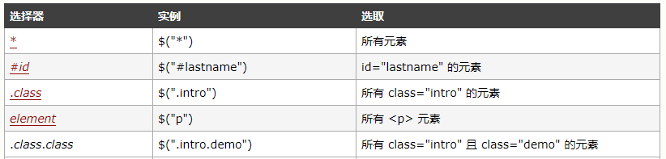
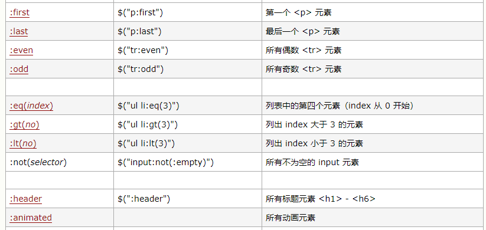

# Jquery

## jquery 对象与 dom 对象

###  jquery对象 转 dom 对象
    console.log($oDiv[0] ===oDiv); //true
    console.log($oDiv.get(0) ===oDiv);//true
    
### dom对象 转 jquery 对象
    console.log($oDiv ===$(oDiv));//false

###  jquery 选择器
1. 基本选择器


2. 层级选择器
$(“parent > child”)	子选择器:选择所有指定”parent”元素中指定的”child”的直接子元素   
$(“ancestor descendant”)	后代选择器:选择给定祖先ancestor元素的所有后代元素，包括子元素，孙子元素等全部后代元素   
$(“prev + next”)	相邻兄弟选择器:选择所有紧接在prev元素后的next元素   
$(“prev ~ siblings”)	一般兄弟选择器：匹配“prev”元素之后的所有兄弟元素。具有相同的父元素，并匹配过滤出 __所有的__ “siblings”选择器。     
 
3. 基本过滤选择器


-- $("#div1>div:not(#div3)"); // id 为div1 下的所有直接子元素div（不包含id为div3的子元素）
-- console.log($("#div1>div:eq(1)"));
--  console.log($("#div1>div:gt(1)")); //  id 为div1 下的所有直接子元素为div且div索引大于1（索引从0开始，包含1）
-- console.log($("#div1>div:lt(1)"));  //  id 为div1 下的所有直接子元素为div且div索引小于1（索引从0开始，包含1）
  :header(固定写法)    
  用法: $(":header").css("background", "#EEE")    返回值  集合元素
  说明: 匹配如 h1, h2, h3之类的标题元素.这个是专门用来获取h1,h2这样的标题元素
   
 :animated(固定写法)   返回值  集合元素   
   说明: 匹配所有正在执行动画效果的元素    
   
4. 内容过滤选择器  
:contains(text)  
用法: $("div:contains('John')")    返回值  集合元素   
说明: 匹配包含给定文本的元素.这个选择器比较有用，当我们要选择的不是dom标签元素时,它就派上    
了用场了,它的作用是查找被标签”围”起来的文本内容是否符合指定的内容的。  

 :empty   
用法: $("td:empty")   返回值  集合元素    
说明: 匹配所有不包含子元素或者文本的空元素。    

  :has(selector)  
用法:  $("div:has('.mini')")返回值  集合元素
说明: 匹配含有选择器所匹配的元素的元素。

  :parent   
  用法: $("td:parent")   返回值  集合元素
说明: 匹配含有子元素或者文本的元素.注意:这里是":parent”,可不是".parent”!感觉与上面讲的”:empty”形成反义词。

5. 可见度过滤选择器    
 
:hidden
用法: $(”tr:hidden”)  返回值  集合元素
说明: 匹配所有的不可见元素，input 元素的 type 属性为 “hidden” 的话也会被匹配到。
意思是css中display:none和input type="hidden"的都会被匹配到.同样,要在脑海中彻底分清楚冒
号":", 点号"."和逗号","的区别。
:visible
用法: $("tr:visible")  返回值  集合元素
说明: 匹配所有的可见元素
 
6. 属性过滤选择器    

1）、[attribute]  
用法: $("div[id]") ;  返回值  集合元素  
说明: 匹配包含给定属性的元素。例子中是选取了所有带”id”属性的div标签。   

2）、[attribute=value]    
用法: $("input[name='newsletter']").attr("checked", true);    返回值  集合元素   
说明: 匹配给定的属性是某个特定值的元素.例子中选取了所有 name 属性是 newsletter 的 input 元素。   

3）、[attribute!=value]$("div[title!='test']").css("background","yellow");  
用法: $(”input[name!='newsletter']“).attr("checked", true);   返回值  集合元素   

说明: 匹配所有不含有指定的属性，或者属性不等于特定值的元素。
此选择器等价于:not此选择器等价于:not([attr=value]),要匹配含有特定属性但不等于特定值的元素,请使用[attr]:not([attr=value])。之前看到的:not 派上了用场。

4）、[attribute^=value]  
用法: $(”input[name^=‘news’]“)  返回值  集合元素 
说明: 匹配给定的属性是以某些值开始的元素.,我们又见到了这几个类似于正则匹配的符号。

5）、[attribute$=value]   
用法: $("input[name$='letter']")  返回值  集合元素 
说明: 匹配给定的属性是以某些值结尾的元素。

6）、[attribute*=value]  
用法: $("input[name*='man']")   返回值  集合元素
说明: 匹配给定的属性是以包含某些值的元素。

7）、[attributeFilter1][attributeFilter2][attributeFilterN]
用法: $("input[id][name$='man']")  返回值  集合元素
说明: 复合属性选择器,需要同时满足多个条件时使用.又是一个组合,这种情况我们实际使用的时候很常
用.这个例子中选择的是所有含有 id 属性,并且它的 name 属性是以 man 结尾的元素。


7. 子元素过滤选择器   
1）、:nth-child(index/even/odd/equation)
$("div[class=one] :nth-child(2)").css("background","yellow");  
用法: $("ul li:nth-child(2)")   返回值  集合元素  
说明: 匹配其父元素下的第N个子或奇偶元素.这个选择器和之前说的基础过滤(Basic Filters)中的  
eq() 有些类似,不同的地方就是前者eq是从0开始,后者nth-child是从1开始。  

2）、:first-child  
$("div[class=one] :first-child")  
用法: $("ul li:first-child")    返回值  集合元素 
说明: 匹配第一个子元素。':first' 只匹配一个元素,而此选择符将为每个父元素匹配一个子元素。这里需要特别点的记忆下区别。

3）、:last-child  
用法: $("ul li:last-child")      返回值  集合元素   
说明: 匹配最后一个子元素.':last'只匹配一个元素,而此选择符将为每个父元素匹配一个子元素。  

4）、: only-child  
 用法: $("ul li:only-child")   返回值  集合元素 
 说明: 如果某个元素是父元素中唯一的子元素,那将会被匹配。如果父元素中含有其他元素,那将不会被匹配。意思就是:只有一个子元素的才会被匹配。    


8. 表单对象属性过滤选择器  
 此选择器主要对所选择的表单元素进行过滤。   

1）、:enabled   
用法: $("input:enabled")    返回值  集合元素
说明: 匹配所有可用元素。意思是查找所有input中不带有disabled="disabled"的input。不为   
disabled,当然就为enabled。

2）、:disabled  
用法: $("input:disabled")    返回值  集合元素   
说明: 匹配所有不可用元素。与上面的enable是相对应的。   

3）、:checked  
用法: $("input:checked")   返回值  集合元素  
说明: 匹配所有选中的被选中元素(复选框、单选框等，不包括select中的option) 。  

4）、:selected   
用法: $(”select option:selected”)   返回值  集合元素  
说明: 匹配所有选中的option元素.$("select>option:selected")  


9. 表单选择器

1）、:input
用法: $(":input") ;   返回值  集合元素
说明:匹配所有 input, textarea, select 和 button 元素。

2）、:text
用法: $(":text") ;  返回值  集合元素
说明: 匹配所有的单行文本框。

3）、:password
用法: $(":password") ; 返回值  集合元素
说明: 匹配所有密码框。

4）、:radio
用法: $(":radio") ; 返回值  集合元素
说明: 匹配所有单选按钮。

5）、:checkbox
用法: $(":checkbox") ; 返回值  集合元素
说明: 匹配所有复选框。

6）、:submit
用法: $(":submit") ;   返回值  集合元素
说明: 匹配所有提交按钮.

7）、:image
用法: $(":image")   返回值  集合元素
说明: 匹配所有图像域。

8）、:reset
用法: $(":reset") ;  返回值  集合元素
说明: 匹配所有重置按钮。

9）、:button
用法: $(":button") ;  返回值  集合元素
说明: 匹配所有按钮.这个包括直接写的元素button。

10）、:file
用法: $(":file") ;  返回值  集合元素
说明: 匹配所有文件域。

11）、:hidden
用法: $("input:hidden") ; 返回值  集合元素
说明: 匹配所有不可见元素，或者type为hidden的元素.这个选择器就不仅限于表单了,除了匹配input中的hidden外,那些style为hidden的也会被匹配

## jQuery 冲突解决

### jQuery库在其它库之后引入

```
 jQuery.noConflict(); //交出$ 控制权
 jQuery(function(){
    jQuery("p").click(function(){
        .....
    })
 }）
 
 ////////////////////////////
 
 
  var $j = jQuery.noConflict(); //交出$ 控制权,自定义快捷方式$j
 
  $j(function(){
     $j("p").click(function(){
         .....
     })
  }）
 
 
 
 //////////
  jQuery.noConflict(); //交出$ 控制权
  jQuery(function($){
      $("p").click(function(){  //此处的$ 为jQuery
          .....
      })
   }）
 
 ////////////
   jQuery.noConflict(); //交出$ 控制权
   (function($){
        $(function(){
               $("p").click(function(){  //此处的$ 为jQuery
                   .....
               })
        })
    })(jQuery)
 
 
```


   