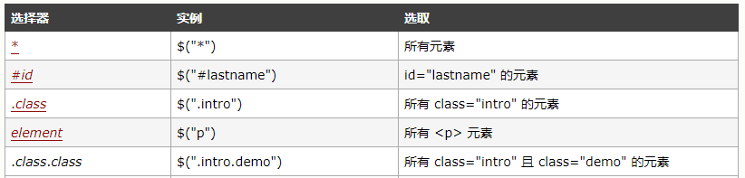

# Jquery

## jquery 对象与 dom 对象

 // jquery对象 转 dom 对象
    console.log($oDiv[0] ===oDiv); //true
    console.log($oDiv.get(0) ===oDiv);//true
    
 //  dom对象 转 jquery 对象
    console.log($oDiv ===$(oDiv));//false

## jquery 选择器

