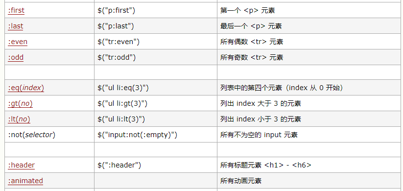

# Jquery

## jquery 对象与 dom 对象

 1. jquery对象 转 dom 对象
    console.log($oDiv[0] ===oDiv); //true
    console.log($oDiv.get(0) ===oDiv);//true
    
2. dom对象 转 jquery 对象
    console.log($oDiv ===$(oDiv));//false

## jquery 选择器
1. 基本选择器

2. 层级选择器
$(“parent > child”)	子选择器:选择所有指定”parent”元素中指定的”child”的直接子元素   
$(“ancestor descendant”)	后代选择器:选择给定祖先ancestor元素的所有后代元素，包括子元素，孙子元素等全部后代元素   
$(“prev + next”)	相邻兄弟选择器:选择所有紧接在prev元素后的next元素   
$(“prev ~ siblings”)	一般兄弟选择器：匹配“prev”元素之后的所有兄弟元素。具有相同的父元素，并匹配过滤出 __所有的__ “siblings”选择器。     
 
3. 基本过滤选择器

-- $("#div1>div:not(#div3)"); // id 为div1 下的所有直接子元素div（不包含id为div3的子元素）
-- console.log($("#div1>div:eq(1)"));
--  console.log($("#div1>div:gt(1)")); //  id 为div1 下的所有直接子元素为div且div索引大于1（索引从0开始，包含1）
-- console.log($("#div1>div:lt(1)"));  //  id 为div1 下的所有直接子元素为div且div索引小于1（索引从0开始，包含1）
  :header(固定写法)    
  用法: $(":header").css("background", "#EEE")    返回值  集合元素
  说明: 匹配如 h1, h2, h3之类的标题元素.这个是专门用来获取h1,h2这样的标题元素
   
 :animated(固定写法)   返回值  集合元素   
   说明: 匹配所有正在执行动画效果的元素    
   
4. 内容过滤选择器  
 :contains(text)  
  用法: $("div:contains('John')")    返回值  集合元素   
说明: 匹配包含给定文本的元素.这个选择器比较有用，当我们要选择的不是dom标签元素时,它就派上    
了用场了,它的作用是查找被标签”围”起来的文本内容是否符合指定的内容的。  

 :empty   
用法: $("td:empty")   返回值  集合元素    
说明: 匹配所有不包含子元素或者文本的空元素。    

  :has(selector)  
用法:  $("div:has('.mini')")返回值  集合元素
说明: 匹配含有选择器所匹配的元素的元素。

  :parent   
  用法: $("td:parent")   返回值  集合元素
说明: 匹配含有子元素或者文本的元素.注意:这里是":parent”,可不是".parent”!感觉与上面讲的”:empty”形成反义词。

   