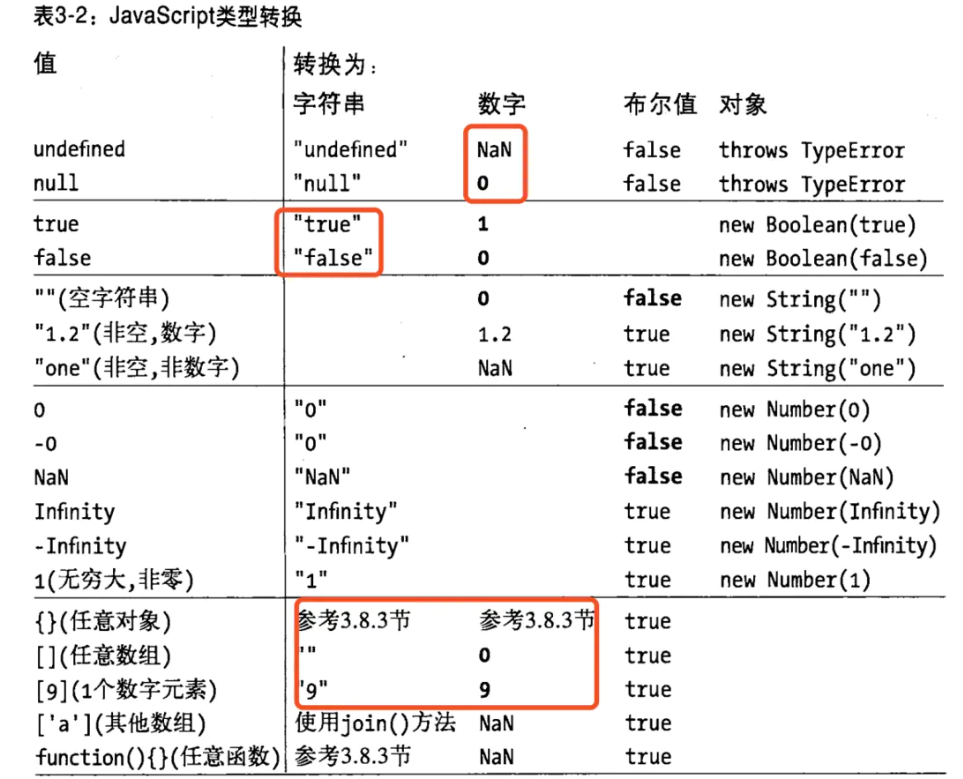

# 类型转换

##  1 JavaScript数据类型（7种）
 - null
 - undefined
 - string
 - number
 - boolean
 - object
 - symbol
 
## 2 typeof 返回的类型
几个注意点： 
- typeof null --- object 
- typeof function a(){} --- function
- typeof [] --- object   
js中，数组和函数,正则，错误，日期等都是对象。


```
	console.log(typeof null); // object 
	console.log(typeof undefined);// undefined 
	console.log(typeof "hello"); //string 
	console.log(typeof 123); // number
	console.log(typeof true); // boolean
	console.log(typeof {}); // object 
	console.log(typeof function a(){}); // function
	console.log(typeof []); // object
	console.log(typeof Symbol("mysymbol")); // symbol
	console.log(typeof /abc/); //  object 
	console.log(typeof new Date()); //  object 
	console.log(typeof new Error()); // object            z  
```
## 3 ToString 

- String(null);// "null"
- String(undefined);// "undefined"
对象转字符串：
- （1）先尝试调用对象的toString()方法，如果对象拥有这个方法且返回一个原始值，js将这个值转换为字符串并返回这个字符串结果；   
- （2）如果对象没有toString()方法，或这个方法并不返回一个原始值，则调用valueOf()方法，如果这个方法存在且返回值是一个原始值，js将这个值转换为字符串并返回这个字符串结果；   
- （3）否则，抛出一个类型错误异常     

 


### 3.1 toString() 方法

- 特别大或者特别小的数字转换为 指数形式
- 数组则会以 ， 拼接起来
- 对象{} 返回 [object Object]
- 日期对象，转换为 这种形式 ：Wed Mar 04 2020 15:19:58 GMT+0800 (中国标准时间)
- RegExp 的 toString 方法返回一个表示正则表达式直接量的字符串。
- 错误对象，转换为 这种形式 ：Error: 错了
```
	//console.log(null.toString()); // null 没有方法
	//console.log(undefined.toString());// undefined 没有方法
	console.log("hello".toString()); // hello 
	console.log((123).toString()); // 123
	console.log((0.0000000000123).toString()); // 1.23e-11
	console.log((123000000000000000000000000000000000).toString()); // 1.23e+35
	console.log(true.toString()); // true
	console.log(({name:"qq"}).toString()); // [object Object]
	console.log((function f(){console.log(9)}).toString()); // function f(){console.log(9)}
	console.log(["a",1].toString()); // a,1
	console.log([1].toString()); //  1
	console.log(Symbol("mysymbol").toString());// Symbol(mysymbol)
	console.log(/abc/.toString());// /abc/
	console.log(new Date().toString()); // Wed Mar 04 2020 15:19:58 GMT+0800 (中国标准时间)
	console.log(new Error("错了").toString()); // Error: 错了
```

### 3.2 Object 的toString()

```
	console.log(Object.prototype.toString.call(null));// [object Null]
	console.log(Object.prototype.toString.call(undefined)); //[object Undefined]
	console.log(Object.prototype.toString.call("hello"));// [object String]
	console.log(Object.prototype.toString.call(123)); // [object Number]
	console.log(Object.prototype.toString.call(true));// [object Boolean]
	console.log(Object.prototype.toString.call({})); // [object Object]
	console.log(Object.prototype.toString.call(function a(){})); // [object Function]
	console.log(Object.prototype.toString.call([])); // [object Array]
	console.log(Object.prototype.toString.call(Symbol("mysymbol"))); // [object Symbol]
	
	console.log(Object.prototype.toString.call(/abc/));// [object RegExp]
	console.log(Object.prototype.toString.call(new Date()));// [object Date]
	console.log(Object.prototype.toString.call(new Error()));// [object Error]
```
## 4 valueOf()
 
- （1） 如果对象具有 valueOf 方法，且返回一个原始值，则 JavaScript 将这个原始值转换为数字并返回这个数字
- （2） 否则，如果对象具有 toString 方法，且返回一个原始值，则 JavaScript 将其转换并返回。
- （3） 否则，JavaScript 抛出一个类型错误异常。


```
	//console.log(null.valueof()); // null 没有方法
	//console.log(undefined.valueof());// undefined 没有方法
	console.log("hello".valueOf()); // hello 
	console.log((123).valueOf()); // 123
	console.log(true.valueOf()); // true
	console.log({name:"qq"}.valueOf()); // {name: "qq"}
	console.log((function f(){console.log(9)}).valueOf()); // function f(){console.log(9)}
	console.log(["a",1].valueOf()); // ["a",1]
	console.log([1].valueOf()); // [1]
	console.log(Symbol("mysymbol").valueOf());// Symbol(mysymbol)
	console.log(/abc/.valueOf());// /abc/
	console.log(new Date().valueOf()); // 1583307166346
	console.log(new Error("错了").valueOf()); // Error: 错了 at testValueOf (类型转换2.html:57)
```
## 5 ToNumber()
- true 转换为1，false转化为0
- null转换为0，undefined转换为NaN
- 如果 是字符串，
  （1）空字符转化为0
  （2）字符串前面的0被忽略，ox开头则按照十六进制进行转换
  （3）字符串中 包含其它非 ”数字“的字符，转换为NaN

对象转换为数字：

（1）先尝试调用对象的valueOf()方法，如果对象拥有这个方法且返回一个原始值，js*将这个值转换为数字（需要的话）*并返回这个数字；   
（2）如果对象没有valueOf()方法，或这个方法并不返回一个原始值，则调用toString()方法，如果这个方法存在且返回值是一个原始值，js将这个值转换为数字（如果需要的话）并返回；  
（3）否则，抛出一个类型错误异常    
 

```
	console.log(Number(null)); //  0
	console.log(Number(undefined));//  NaN
	console.log(Number(true)); //  1
	console.log(Number(false)); // 0
	
	console.log(Number({age:1})); //  NaN
	console.log(Number(function f(){console.log(9)})); //  NaN
	console.log(Number(["a",1])); //  NaN
	console.log(Number([1])); //  1
	// console.log(Number(Symbol("mysymbol")));//  报错 Cannot convert a Symbol value to a number

	console.log(Number(/abc/));// NaN
	console.log(Number(new Date())); // 1583309314370
	console.log(Number(new Error("错了"))); //  NaN
	
	// 字符串 转 数字
	console.log(Number("12")); // 12
	console.log(Number("012"));// 12
	console.log(Number("1.2"));// 1.2
	console.log(Number("01.2"));// 1.2
	console.log(Number("0x10"));// 16
	console.log(Number(""));// 0
	console.log(Number("12a"));// NaN
```

## 6 ToBoolean
以下falsey值转换为false，其余皆转换为 true
 -undefined
 -null
 -+0或-0
 -NaN
 -''（空字符串）

```

let user = {
		  name: "John",
		  money: 1000,

		  // 对于 hint="string"
		  toString() {
			return `{name: "${this.name}"}`;
		  },

		  // 对于 hint="number" 或 "default"
		  valueOf() {
			return this.money;
		  }

		};

		alert(user); // toString -> {name: "John"}
		alert(+user); // valueOf -> 1000
		alert(user + 500); // valueOf -> 1500
		alert(""+user); //valueOf  ->   1000
		alert(user+""); // valueOf  ->  1000

```


## 7 ToPrimitive

ToPrimitive(input[, PreferredType])

- 第一个参数是 input，表示要处理的输入值。
- 第二个参数是 PreferredType，非必填，表示希望转换成的类型，有两个值可以选，Number 或者 String。
- 当不传入 PreferredType 时，如果 input 是日期类型，相当于传入 String，否则，**都相当于传入 Number**。
- 如果传入的 input 是 Undefined、Null、Boolean、Number、String 类型，直接返回该值。

- 如果传入的 input 是对象，
如果是 ToPrimitive(obj, Number)，处理步骤如下：

1. 如果 obj 为 基本类型，直接返回
2. 否则，调用 valueOf 方法，如果返回一个原始值，则 JavaScript 将其返回。
3. 否则，调用 toString 方法，如果返回一个原始值，则 JavaScript 将其返回。
4. 否则，JavaScript 抛出一个类型错误异常。

如果是 ToPrimitive(obj, String)，处理步骤如下：

1. 如果 obj为 基本类型，直接返回
2. 否则，调用 toString 方法，如果返回一个原始值，则 JavaScript 将其返回。
3. 否则，调用 valueOf 方法，如果返回一个原始值，则 JavaScript 将其返回。
4. 否则，JavaScript 抛出一个类型错误异常。


## 8 类型转换



几个易出差的地方：
- undefined 转数字为NaN;
- null转数字为0；


### 8.1 显式类型转换 
显示类型转换按照前文所述的进行转换，相对比较简单和明显；

### 8.2 隐式类型转换

#### 8.2.1 算术表达式
 
算术运算符包括二元算术运算符+、-、*、/、%和一元算术运算符+、-、++、-- 
除 **二元+ 运算符**比较复杂外（既可以算术加法，也可以是字符串拼接） 
其余的几种将操作数转化为数字（无法转化为数字的都转化为NaN，且操作结果也是NaN）


#### 8.2.2 二元+运算符


二元加法运算符的复杂之处在于既能对两个数字做加法，也能做字符串连接，行为表现为：


 -1 如果其中一个操作数是对象，则遵循上面提到的对象转为原始值规则转换为原始值，其中又遵循两点规则：

    (1)绝大多数对象遵循对象转换为数字的规则，即先尝试valueOf再调用toString
    (2)日期对象类型到原始值的转换是使用对象到字符串的转换，即先尝试toString再调用valueOf
    (3)这里的转换并不会真的将对象强制转换为数字或字符串，而是使用按转换规则处理后得到的原始值，    
	例如对象转数字规则，如果调用toString方法后返回了字符串原始类型则不会再转为数字类型返回
 -2 如果其中一个操作数是字符串的话，另一个操作数也会转化为字符串然后进行字符串拼接；
 -3 否则两个操作数都转化为数字（或NaN），然后做加法.


#### 8.2.3 关系表达式

关系运算符包括:==、===、!=、!==、>、<、>=、<=等，=== 和 !==是不做类型转换.  
关系表达式的行为表现如下:

 -1. 注意 null == undefined，除此之外，undefined和null与其他任何结果的比较值都为false;
 -2. NaN和其他任何类型比较永远返回false(包括和他自己)，NaN == NaN //false
 -3. 如果一个操作数是字符串，一个操作数是数字，先将字符串转换为数字；
 -4. 如果其中一个操作数是bool值，先将其转换为数字；
 -5. 如果一个操作数是对象，另一个是数字或字符串，则遵循上面提到的对象转为原始值规则转换为原始值再进行比较，这里的转换和二元+运算符一样，符合：
   （1）绝大多数对象遵循对象转换为数字的规则，即先尝试valueOf再调用toString
   （2）日期对象类型到原始值的转换是使用对象到字符串的转换，即先尝试toString再调用valueOf
   （3）这里的转换并不会真的将对象强制转换为数字或字符串，而是使用按转换规则处理后得到的原始值，例如对象转数字规则，如果调用toString方法后返回了字符串原始类型则不会再转为数字类型返回
 


