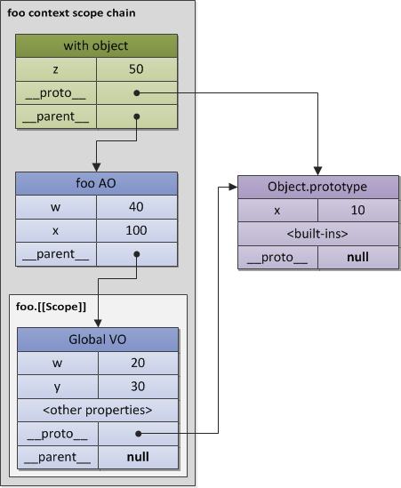

# 作用域

## 1 javascript的内部编译过程


以var a = 2;为例，说明javascript的内部编译过程，主要包括以下三步：

1. 分词(tokenizing)
 把由字符组成的字符串分解成有意义的代码块，这些代码块被称为词法单元(token)
 var a = 2;被分解成为下面这些词法单元：
 var、a、=、2、;。这些词法单元组成了一个词法单元流数组

```
// 词法分析后的结果
[
  "var" : "keyword",
  "a" : "identifier",
  "="   : "assignment",
  "2"  : "integer",
  ";"   : "eos" (end of statement)
]
```

2. 解析(parsing)

把词法单元流数组转换成一个由元素逐级嵌套所组成的代表程序语法结构的树，这个树被称为“抽象语法树” (Abstract Syntax Tree, AST)
var a = 2;的抽象语法树中有一个叫VariableDeclaration的顶级节点，接下来是一个叫Identifier(它的值是a)的子节点，
以及一个叫AssignmentExpression的子节点，且该节点有一个叫Numericliteral(它的值是2)的子节点

```
{
  operation: "=",
  left: {
    keyword: "var",
    right: "a"
  }
  right: "2"
}
```
3. 代码生成

将AST转换为可执行代码的过程被称为代码生成.
var a=2;的抽象语法树转为一组机器指令，用来创建一个叫作a的变量(包括分配内存等)，并将值2储存在a中.
实际上，javascript引擎的编译过程要复杂得多，包括大量优化操作，上面的三个步骤是编译过程的基本概述.
任何代码片段在执行前都要进行编译，大部分情况下编译发生在代码执行前的几微秒.
javascript编译器首先会对var a=2;这段程序进行编译，然后做好执行它的准备，并且通常马上就会执行它.


## 2 查询
引擎查询共分为两种：LHS查询和RHS查询，从字面意思去理解，当变量出现在赋值操作的左侧时进行LHS查询，出现在右侧时进行RHS查询。
更准确地讲，RHS查询与简单地查找某个变量的值没什么区别，而LHS查询则是试图找到变量的容器本身，从而可以对其赋值。

```
function foo(a){
    console.log(a);//2
}
foo( 2 );
/*
　　这段代码中，总共包括4个查询，分别是：
　　1、foo(...)对foo进行了RHS引用
　　2、函数传参a = 2对a进行了LHS引用
　　3、console.log(...)对console对象进行了RHS引用，并检查其是否有一个log的方法
　　4、console.log(a)对a进行了RHS引用，并把得到的值传给了console.log(...)
*/
```

## 3 嵌套

在当前作用域中无法找到某个变量时，引擎就会在外层嵌套的作用域中继续查找，直到找到该变量，或抵达最外层的作用域（也就是全局作用域）为止。

## 4 异常

### 4.1 RHS

1. 如果RHS查询失败，引擎会抛出ReferenceError(引用错误)异常

```
//对b进行RHS查询时，无法找到该变量。也就是说，这是一个“未声明”的变量

function foo(a){
    a = b;
}
foo();//ReferenceError: b is not defined
```

2. 如果RHS查询找到了一个变量，但尝试对变量的值进行不合理操作，比如对一个非函数类型值进行函数调用，
或者引用null或undefined中的属性，引擎会抛出另外一种类型异常：TypeError(类型错误)异常

```
function foo(){
    var b = 0;
    b();
}
foo();//TypeError: b is not a function
```

### 4.2 LHS

1. 当引擎执行LHS查询时，如果无法找到变量，全局作用域会创建一个具有该名称的变量，并将其返还给引擎。

```
function foo(){
    a = 1;
}
foo();
console.log(a);//1
```

2.如果在严格模式中LHS查询失败时，并不会创建并返回一个全局变量，引擎会抛出同RHS查询失败时类似的ReferenceError异常。

```
function foo(){
    'use strict';
    a = 1;
}
foo();
console.log(a);//ReferenceError: a is not defined
```

## 5 词法作用域(静态作用域)
javascript使用的是 __词法作用域__。
1. 词法作用域就是定义在词法阶段的作用域，是由写代码时将变量和块作用域写在哪里来决定的，因此当词法分析器处理代码时会保持作用域不变
2. 无论函数在哪里被调用，也无论它如何被调用，它的词法作用域都只由函数被声明时所处的位置决定。

```
var a = 2;
function foo() {
    console.log( a );  //2
}
function bar() {
    var a = 3;
    foo();
}
bar(); //2
```

3. 遮蔽。 作用域查找从运行时所处的最内部作用域开始，逐级向外或者说向上进行，直到遇见第一个匹配的标识符为止，
在多层的嵌套作用域中可以定义同名的标识符，这叫作“遮蔽效应”，内部的标识符“遮蔽”了外部的标识符。
```
var a = 0;
function test(){
    var a = 1;
    console.log(a);//1, 不是0
}
test();
```

```

var value = 1;

function foo() {
    console.log(value);
}

function bar() {
    var value = 2;
    foo();
}

bar(); // 1 

//JavaScript采用静态作用域 ：
// 执行 foo 函数，先从 foo 函数内部查找是否有局部变量 value，如果没有，就根据书写的位置，
// 查找上面一层的代码，也就是 value 等于 1，所以结果会打印 1。

```


## 6 动态作用域
 
bash 就是动态作用域，例如如下的 scope.bash，用命令行执行 bash ./scope.bash，
 
```
value=1
function foo () {
    echo $value;
}
function bar () {
    local value=2;
    foo;
}
bar


```

**----------欺骗词法----------**
欺骗词法会导致性能下降，主要有eval 和 with，不推荐使用，这里仅加深对词法作用域理解而说明。

1. eval
eval 在运行期修改词法作用域

```
function foo(str,a){
    eval(str);
    console.log(a,b)
}
var b = 2;
foo('var b = 3;',1) ;// 1 , 3 
```
严格模式下，eval在运行时有自己的词法作用域。


```
function foo(str){
    'use strict';
    eval(str);
    console.log(a)
}
foo('var a = 3;') ;// ReferenceError:a is not defined
```

2. with
with 可以将一个没有或有多个属性的对象处理为一个完全隔离的词法作用域，        
因此这个对象的属性也会被处理为定义在这个作用域中的词法标识符.

with 块可以将一个对象处理为词法作用域，但是这个块内部正常的 var 声明并不会被限制在这个块的作用域中，          
而是被添加到 with 所处的函数作用域中。       


```
 
function foo(obj) {
     with (obj) {
        a = 2; 
        b = 3;    
        var aa = 9;
    }
    console.log(aa);  // 9  正常的 var 声明并不会被限制在这个块的作用域中
    console.log(obj); //{a: 2 }
 }
var obj = {a:1}
foo(obj);
console.log(b); //3    b 泄露到全局了！！
```

当我们传递 obj 给 with 时，with 所声明的作用域是 obj，    
而这个作用域中含 有一个同 obj.a 属性相符的标识符,因此 a=2 修改了obj.a的值。      
当执行 b=3 时，并未查找到obj.b ,因此进行了正常的 LHS 标识符查找,    
由于未查找到b，自动创建了一个全局变量b（因为是非严格模式）。


## 7 变量声明提升

1. 变量和函数在内的所有声明都会在任何代码被执行前首先被处理

```
a = 2 ;
var a;
console.log( a );
```

2. 每个作用域都会进行提升操作

```
    console.log(a); //undefined
    var a = 0;
    function fn(){
        console.log(b);  //undefined
        var b = 1;
        function test(){
            console.log(c);  //undefined
            var c = 2;
        }
        test();
    }
    fn();
```
3. 函数覆盖
  > 函数声明和变量声明都会被提升。但是，函数声明会覆盖变量声明
  > 变量的重复声明是无用的，但函数的重复声明会覆盖前面的声明(无论是变量还是函数声明)

```
//函数声明会覆盖变量声明
var a;
function a(){}
console.log(a);//'function a(){}'
```

```
//函数的重复声明会覆盖前面的声明
a();//2
function a(){
    console.log(1);
}
function a(){
    console.log(2);
}
```

## 8 块作用域

1. let
ES6引入了新的let关键字，提供了除var以外的另一种变量声明方式。
> let关键字可以将变量绑定到所在的任意作用域中(通常是{...}内部)，实现块作用域。
> let不允许在相同作用域内，重复声明同一个变量
> 使用let进行的声明不会在块作用域中进行提升

```
{
  let i = 1;
};
console.log(i);//ReferenceError: i is not defined

var a = [];
for(let i = 0; i < 5; i++){
    a[i] = function(){
        return i;
    }
}
console.log(a[4]());//4
```

2. const

> const 值是固定的（常量）。之后任何试图修改值的操作都会引起错误
> const声明的常量，也与let一样不可重复声明
> const声明时必须赋值
> const 引用类型的值可以修改属性（引用的地址不变）

3. try .. catch 分句会创建一个块作用域，其中声明的变量仅在 catch 内部有效。
```
    try{
        var a= 100;
        throw 2;
    }catch(e){
        console.log( a ); //100
        console.log( e ); //2
    }
    console.log( a ); //100
    console.log( e ); //ReferenceError: a is not defined
```

## 9 可执行代码
JavaScript 的可执行代码(executable code)就三种：
- 全局代码
- 函数代码
- eval代码。          

## 10 执行上下文栈 Execution Context Stack
1. 每一种代码的执行都需要依赖自身的上下文。当然global的上下文可能涵盖了很多的function和eval的实例。                    
2. 函数的每一次调用，都会进入函数执行中的上下文,并且来计算函数中变量等的值。    
3. eval函数的每一次执行，也会进入eval执行中的上下文，判断应该从何处获取变量的值。        

```
// 调用同一函数产生不同的上下文
function foo(bar) {}

// 调用相同的function，每次都会产生3个不同的上下文
//（包含不同的状态，例如参数bar的值）

foo(10);
foo(20);
foo(30);
```

4. 一个执行上下文可以激活另一个上下文，就好比一个函数调用了另一个函数，从而形成上下文堆栈。  

5. 激活其它上下文的某个上下文被称为**调用者(caller)** 。被激活的上下文被称为**被调用者(callee)** 。        
被调用者同时也可能是调用者(比如一个在全局上下文中被调用的函数调用某些自身的内部方法)。              

如下图，所有的ECMAScript的程序执行都可以看做是一个执行上下文堆栈[execution context (EC) stack]。                
堆栈的顶部就是处于激活状态的上下文。      

  
 

```
// 代码1
var scope = "global scope";
function checkscope(){
    var scope = "local scope";
    function f(){
        return scope;
    }
    return f();
}
checkscope();

/*
// 代码1 上下文堆栈模拟
ECStack.push(<checkscope> functionContext);
ECStack.push(<f> functionContext);
ECStack.pop();
ECStack.pop();
*/


// 代码2
var scope = "global scope";
function checkscope(){
    var scope = "local scope";
    function f(){
        return scope;
    }
    return f;
}
checkscope()();
/*
// 代码2 上下文堆栈模拟
ECStack.push(<checkscope> functionContext);
ECStack.pop();
ECStack.push(<f> functionContext);
ECStack.pop();
*/


```

### 10.1 全局代码

在初始化（程序启动）阶段，ECStack是这样的：

```
ECStack = [
  globalContext
];
```

### 10.2 函数代码

```
(function  foo(bar) {
  if (bar) {
    return;
  }
  foo(true);
})();

```
那么，ECStack以如下方式被改变：

```
// 第一次foo的激活调用
ECStack = [
  <foo> functionContext
  globalContext
];
 
// foo的递归激活调用
ECStack = [
  <foo> functionContext – recursively
  <foo> functionContext
  globalContext
];
```

### 10.3 Eval 代码
eval 代码有一个概念：调用上下文(calling context),例如，eval函数调用的时候产生的上下文。
eval(变量或函数声明)活动会影响调用上下文(calling context)。           

```
eval('var x = 10');
 
(function foo() {
  eval('var y = 20');
})();
 
alert(x); // 10
alert(y); //  Uncaught ReferenceError: y is not defined

```

ECStack的变化过程：    

```
ECStack = [
  globalContext
];
 
// eval('var x = 10');
ECStack.push(
  evalContext,
  callingContext: globalContext
);
 
// eval exited context
ECStack.pop();
 
// foo funciton call
ECStack.push(<foo> functionContext);
 
// eval('var y = 20');
ECStack.push(
  evalContext,
  callingContext: <foo> functionContext
);
 
// return from eval
ECStack.pop();
 
// return from foo
ECStack.pop();
```


## 11 执行上下文 Execution Context 
当 JavaScript 代码执行一段可执行代码(executable code)时，会创建对应的执行上下文(execution context)。           
一个执行的上下文可以抽象的理解为object。于每个执行上下文，都有三个重要属性：  
- 变量对象(Variable object，VO)   
- 作用域链(Scope chain)   
- this  
 
```
activeExecutionContext = {
    VO: {...}, // or AO
    this: thisValue,
    Scope: [ // Scope chain
      // 所有变量对象的列表
      // for identifiers lookup
    ]
};
```


## 12 变量对象 Variable Object 与 活动对象 Activation Object
变量对象(variable object) 是与执行上下文相关的 数据作用域(scope of data) 。   

变量对象(缩写为VO)是一个与执行上下文相关的特殊对象，它存储着在上下文中声明的以下内容：
- 变量 (var, 变量声明);
- 函数声明 (FunctionDeclaration, 缩写为FD);
- 函数的形参

注意：**函数表达式[function expression]（而不是函数声明）是不包含在VO[variable object]里面的**。


### 12.1 不同执行上下文中的变量对象


```
抽象变量对象VO (变量初始化过程的一般行为)
  ║
  ╠══> 全局上下文变量对象GlobalContextVO
  ║        (VO === this === global)
  ║
  ╚══> 函数上下文变量对象FunctionContextVO
           (VO === AO, 并且添加了<arguments>和<formal parameters>)
``` 

1. 全局上下文中的变量对象
- 全局对象(Global object) 是在**进入任何执行上下文之前就已经创建**了的对象；
- 这个对象**只存在一份**，它的属性在程序中任何地方都可以访问，全局对象的生命周期终止于程序退出那一刻。

全局对象初始创建阶段将Math、String、Date、parseInt作为自身属性，等属性初始化.  
```
global = {
  Math: <...>,
  String: <...>
  ...
  ...
  window: global //引用自身
};
```


2. 函数上下文中的变量对象
在函数执行上下文中，VO是不能直接访问的，此时由**活动对象(activation object,缩写为AO)扮演VO**的角色。即VO(functionContext) === AO;

活动对象是在进入函数上下文时刻被创建的，它通过函数的arguments属性初始化。    
Arguments对象是活动对象的一个属性，它包括如下属性：      
- a. callee — 指向当前函数的引用
- b. length — 真正传递的参数个数
- c. properties-indexes (字符串类型的整数) 属性的值就是函数的参数值(按参数列表从左到右排列)。 


### 12.2 处理上下文代码的2个阶段

执行上下文的代码被分成两个基本的阶段来处理：  

1. 进入执行上下文
2. 执行代码

### 12.2.1 进入执行上下文
当进入执行上下文(代码执行之前)时，VO里已经包含了下列属性 ：

- 函数的所有形参(如果我们是在函数执行上下文中)    
由名称和对应值组成的一个变量对象的属性被创建；没有传递对应参数的话，那么由名称和undefined值组成的一种变量对象的属性也将被创建。

- 所有函数声明(FunctionDeclaration, FD)
由名称和对应值（函数对象(function-object)）组成一个变量对象的属性被创建；如果变量对象已经存在相同名称的属性，则完全替换这个属性（同名情况下，函数覆盖变量）。

- 所有变量声明(var, VariableDeclaration)
由名称和对应值（undefined）组成一个变量对象的属性被创建；如果变量名称跟已经声明的形式参数或函数相同，则变量声明不会干扰已经存在的这类属性  

```
function test(a, b) {
  var c = 10;
  function d() {}
  var e = function _e() {};
  (function x() {});  // 函数表达式并不在AO中
}
 
test(10); // call

// 当进入带有参数10的test函数上下文时，AO表现为如下：

AO(test) = {
  a: 10,
  b: undefined,
  c: undefined,
  d: <reference to FunctionDeclaration "d">
  e: undefined
};

```

### 12.2.2 代码执行

```

function test(a, b) {
  var c = 10;
  function d() {}
  var e = function _e() {};
  (function x() {});  // 函数表达式并不在AO中
}
 
test(10); // call

// 代码执行时：
AO['c'] = 10;
AO['e'] = <reference to FunctionExpression "_e">;
```

### 12.2.3 关于变量

任何时候，变量只能通过使用var关键字才能声明。比如:
没有通过var 声明， a =99,此时会在全局window上创建属性a。 与var a =99 相比， a=99 可以删除，而 var a =99 不可以删除。
原因： 变量相对于简单属性来说，变量有一个特性(attribute)：{DontDelete},这个特性的含义就是不能用delete操作符直接删除变量属性。


特例是eval上下文，变量没有{DontDelete}特性。

eval('var a = 10;');
alert(window.a); // 10
 
alert(delete a); // true  ，eval创建的变量 没有{DontDelete}特性，可以被删除
 
alert(window.a); // undefined


## 13 作用域链

作用域链是一个 对象列表(list of objects) ，用以检索上下文代码中出现的 标识符(identifiers) 。    

在一般情况下，一个作用域链包括**父级变量对象（variable object）**（作用域链的顶部）、**函数自身变量VO和活动对象（activation object）**。          
不过，有些情况下**也会包含其它的对象**，例如在执行期间，动态加入作用域链中的—例如**with或者catch语句**。  
[with-objects指的是with语句，产生的临时作用域对象；catch-clauses指的是catch从句，如catch(e)，这会产生异常对象，导致作用域变更]。    

以函数的创建和激活两个时期来讲解作用域链是如何创建和变化.


### 13.1 函数创建

```
var x = 10;
 
(function foo() {
  var y = 20;
  (function bar() {
    var z = 30;
    // "x"和"y"是自由变量
    // 会在作用域链的下一个对象中找到（函数”bar”的互动对象之后）
    console.log(x + y + z);
  })();
})();
 
``` 
函数创建时，生成的活动对象AO如下： 

```
fooContext.AO = {
  y: undefined // undefined – 进入上下文的时候是20 – at activation
};


```

函数“foo”能访问一个更高一层上下文的变量对象, 这种机制是通过函数内部的[[scope]]属性来实现的。

```
foo.[[Scope]] = [
  globalContext.VO // === Global
];

```

### 13.2 函数激活

进入上下文创建AO/VO之后，上下文的Scope属性（变量查找的一个作用域链）作如下定义：          
Scope = AO|VO + [[Scope]]

下图中是一个作用域链示意图，途中的 __parent__ 为模拟的名称，可认为是[[Scope]]


### 13.3 with或者catch 扩大作用域链  

使用with或者catch语句就会改变作用域链。而这些对象都是一些简单对象，他们也会有原型链。这样的话，作用域链会从两个维度来搜寻。
1. 首先在原本的作用域链
2. 每一个链接点的作用域的链（如果这个链接点是有prototype的话）

```
Object.prototype.x = 10;
 
var w = 20;
var y = 30;
 
// 全局上下文的变量对象是从"Object.prototype"继承到的
// 所以我们可以得到“没有声明的全局变量”
// 因为可以从原型链中获取
 
console.log(x); // 10
 
(function foo() {
 
  // "foo" 是局部变量
  var w = 40;
  var x = 100;
 
  // 注意："x" 从"Object.prototype"得到，注意值是10哦
  // 因为{z: 50}是从它那里继承的
 
  with ({z: 50}) {
    console.log(w, x, y , z); // 40, 10, 30, 50    这里的x 是10 而不是100
  }
 
  // 在"with"对象从作用域链删除之后
  // x又可以从foo的上下文中得到了，注意这次值又回到了100哦
  // "w" 也是局部变量
  console.log(x, w); // 100, 40    这里的x 又成了100
 
  // 在浏览器里
  // 我们可以通过如下语句来得到全局的w值
  console.log(window.w); // 20
 
})();


```


### 13.4 几种需注意的作用域链

#### 13.4.1 构造函数创建的函数的[[scope]]

示例：通过函数构造函数（Function constructor）创建的函数“barFn”，是不能访问局部变量“y”的。           
**通过函构造函数创建的函数的[[scope]]属性总是唯一的全局对象**。    
```
var x = 10;
 
function foo() {
 
  var y = 20;
 
  function barFD() { // 函数声明
    alert(x);
    alert(y);
  }
 
  var barFE = function () { // 函数表达式
    alert(x);
    alert(y);
  };
 
  var barFn = Function('alert(x); alert(y);');  // [[scope]]属性总是唯一的全局对象，全局的y为undefined
 
  barFD(); // 10, 20
  barFE(); // 10, 20
  barFn(); // 10, "y" is not defined  
 
}
 
foo();

```


#### 13.4.2 全局和eval上下文中的作用域链
全局上下文的作用域链仅包含全局对象。代码eval的上下文与当前的调用上下文（calling context）拥有同样的作用域链。   
  
```
globalContext.Scope = [
  Global
];
 
evalContext.Scope === callingContext.Scope;

```


#### 13.4.3 with声明和catch语句
with声明和catch语句的作用域链简要的作如下修改：

Scope = withObject|catchObject + AO|VO + [[Scope]]         
Scope = catchObject + AO|VO + [[Scope]]              

```
var x = 10, y = 10;
 
with ({x: 20}) {
 
  var x = 30, y = 30;
 
  alert(x); // 30
  alert(y); // 30
}  // 这里退出了with产生的作用域
 
alert(x); // 10
alert(y); // 30  // 注意全局的y 被修改成30 

```

 